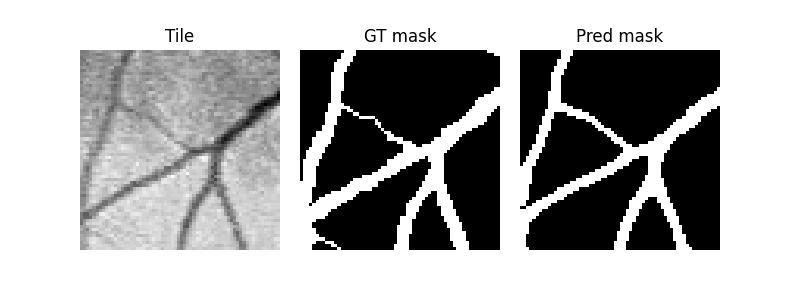

# Retina Segmentation

## Introduction
This repository leverages deep learning to perform retinal blood vessel segmentation, demonstrating the valuable role of AI in early diagnosis of eye diseases, enhancing patient care and preventive health strategies.

## Data
The DRIVE (Digital Retinal Images for Vessel Extraction) dataset was introduced by [_Staal et al. (2004). Ridge-based vessel segmentation in color images of the retina._](https://d1wqtxts1xzle7.cloudfront.net/31909109/downloaded-libre.pdf?1391436831=&response-content-disposition=inline%3B+filename%3DRidge_Based_Vessel_Segmentation_in_Color.pdf&Expires=1701036134&Signature=IppMwatQBoy8X~HNCKwmyfmzudev7Lak8sfaVezQrk95GWxAMYqV8-OZBgCOCJmtUHxFw4RdGtdkHY2nzwHUsk-1RGDGYw5ggQfncXroM~s9axvnU0sYhQ2nTLNQobeqyUJFiyzRZ0Bzx4b3o5WHqXXwIouI0wsU98tmZfK5L4VP1wzDmgRqN5qrjbOJW6~xhW5N~Fs-Q0D-PPeHLZWUuetvlJjbYeFxVF6wanaFunMsK5g9EKgU~8SYI4SdCGk3zRUC~6RD~Z69PB88yWPaFZE8-7X769U9uivK7uaBRW6j6pIiT-fIu7YhXjPQmKTwU04Wma8EDKicxxEsr-gSHw__&Key-Pair-Id=APKAJLOHF5GGSLRBV4ZA). It contains 40 colored fundus oculi images, each 565x584 px, with manual annotations for blood vessels and the optic disc. Since annotations for the DRIVE test set were not found, only images from the original training set are used for this project

## Model
The model employed in this project is based on the UNet architecture from the Monai library. Various configurations with different numbers of hidden layers and residual layers were experimented with to determine the optimal depth for this specific task.

## Training
The training process was conducted within a Dockerized container, utilizing an NVIDIA DGX Titan GPU, and ran for a total of 100 epochs. The loss function employed during training was Dice. For optimization, the Adam optimizer was selected, and the best-performing model was saved as a checkpoint.

## Testing
During the testing phase, two evaluation metrics were calculated: the Dice coefficient and the AUROC (Area Under the Receiver Operating Characteristic curve) on the model's predictions. The model achieved performance scores of 74% for the Dice coefficient and 87% for the AUROC. Additionally, for a visual comparison of the results, images with predictions and ground truths (GTs) were plotted. Here's an example.

## To-Do
- [ ] Improve the segmentation to prevent fragmentation of narrow vessels in the predictions.